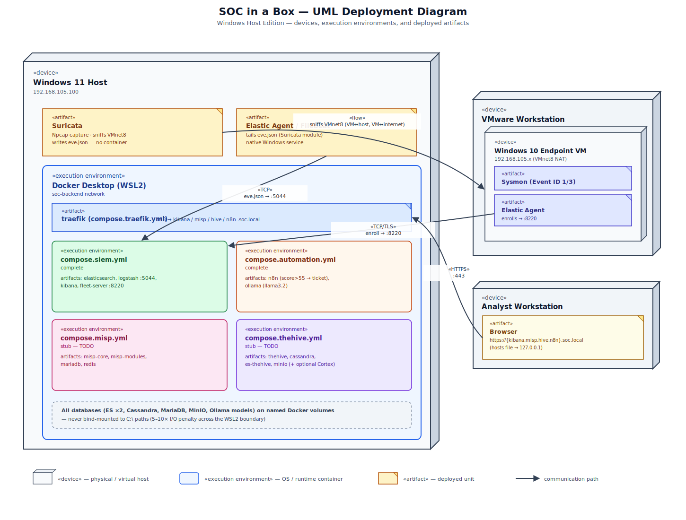

# SOC in a Box — Docker Migration (Windows Host)

Security-operations lab (SIEM, MISP, TheHive, automation) running on a single Windows 11
host: everything containerizable lives in Docker Desktop, network sniffing (Suricata) and
its log shipper (Filebeat) run natively on Windows. Full rationale and phase-by-phase plan:
[soc-in-a-box-docker-migration-plan-windows.md](soc-in-a-box-docker-migration-plan-windows.md).



> **Status:** `compose.automation.yml` and `compose.siem.yml` are complete. `compose.misp.yml`,
> `compose.thehive.yml`, `compose.traefik.yml`, the Logstash pipeline, and the Traefik dynamic
> config are stubs (`TODO`) — see [CLAUDE.md](CLAUDE.md) for what's implemented vs. placeholder.

## Prerequisites

- **Docker Desktop** with the WSL2 backend.
- **`%UserProfile%\.wslconfig`** with explicit memory/processors/swap and the
  `vm.max_map_count` sysctl, or Elasticsearch will crash-loop on every reboot. A checked-in
  copy lives at [windows/wsl/.wslconfig](windows/wsl/.wslconfig) (tuned for a 16GB host — see
  [windows/wsl/README.md](windows/wsl/README.md) before copying it to a different-sized
  machine):
  ```powershell
  Copy-Item windows\wsl\.wslconfig $env:UserProfile\.wslconfig
  wsl --shutdown
  ```
  Then restart Docker Desktop.
- **Npcap** + **Suricata for Windows** (MSI) + **Filebeat for Windows** installed natively —
  these are not containers (see Phase 2b in the plan doc for why).
- **Hosts file** (`C:\Windows\System32\drivers\etc\hosts`):
  ```
  127.0.0.1 kibana.soc.local misp.soc.local hive.soc.local n8n.soc.local
  ```

## First-time setup

```powershell
# 1. Shared network (all compose files expect this to already exist)
docker network create soc-backend

# 2. Secrets
Copy-Item .env.example .env
# then edit .env with real values

# 3. Self-signed cert for *.soc.local into traefik/certs/ (see traefik/certs/README.md)
```

## Bringing services up

Bring stacks up per-phase, in order, so each layer is verified before the next depends on it:

```powershell
# Phase 1 — automation
docker compose -f compose.automation.yml up -d

# Phase 2 — SIEM (Elasticsearch/Logstash/Kibana/Fleet)
docker compose -f compose.siem.yml up -d

# Phase 3 / 4 — MISP / TheHive (once their compose files are filled in)
docker compose -f compose.misp.yml up -d
docker compose -f compose.thehive.yml up -d

# Phase 5 — reverse proxy (once traefik/dynamic/routes.yml is filled in)
docker compose -f compose.traefik.yml up -d
```

Or bring everything up at once with all compose files layered:

```powershell
docker compose `
  -f compose.siem.yml `
  -f compose.misp.yml `
  -f compose.thehive.yml `
  -f compose.automation.yml `
  -f compose.traefik.yml `
  up -d
```

Check status any time with `docker compose -f <file> ps`.

## Native detection layer (not in Docker)

1. Set Suricata's capture interface to the VMware `VMnet8` adapter (`suricata.exe -l` to list,
   or the `\Device\NPF_{GUID}` from `getmac /v`). Run it as a Windows service.
2. Point Filebeat's Suricata module at Suricata's `eve.json` and output to `localhost:5044`
   (Logstash). Ship over TCP — do not bind-mount the log file into a container.
3. Check in the tuned configs under `windows/suricata/` and `windows/filebeat/` once working.

## Endpoint enrollment

On the monitored Windows 10 VM, enroll its Elastic Agent against the containerized Fleet
server (published on the host at `192.168.105.100:8220`):

```powershell
.\elastic-agent.exe uninstall
.\elastic-agent.exe install --url=https://192.168.105.100:8220 --enrollment-token=<token> --insecure
```

## n8n workflows

Export workflows to JSON under `workflows/`, rewiring endpoint URLs per the Phase 6 table in
the plan doc (old VM IPs → Docker service names / `host.docker.internal`), then import them
into n8n at `https://n8n.soc.local/` and activate.

## Validation

Re-run the 14 checks in Phase 8 of the plan doc (connectivity, web UI reachability, log
collection, Nmap-scan detection, phishing trigger, MISP enrichment, Ollama scoring,
end-to-end automation latency, port/firewall exposure) plus a full host reboot to confirm
everything self-heals (`restart: unless-stopped`, Suricata/Filebeat as Windows services,
`vm.max_map_count` surviving `wsl --shutdown`).

## Troubleshooting

| Symptom | Cause | Fix |
|---|---|---|
| Elasticsearch crash-loops after reboot | `vm.max_map_count` not set | Add `kernelCommandLine` to `.wslconfig`, `wsl --shutdown`, restart Docker Desktop |
| Terrible DB performance | Bind mount to `C:\` instead of a named volume | Audit compose files for accidental `C:\` bind mounts on data dirs |
| Suricata sees no traffic | Sniffing from inside a container | Never sniff in Docker Desktop; run Suricata natively against the VMnet8 adapter |
| Endpoint can't reach Fleet/Beats | Windows Firewall blocking inbound | Allow inbound 8220/5044/443 |
| WSL2 starving on RAM | No explicit `memory=` in `.wslconfig` | Set it explicitly; WSL2 otherwise caps at 50% of host RAM |
